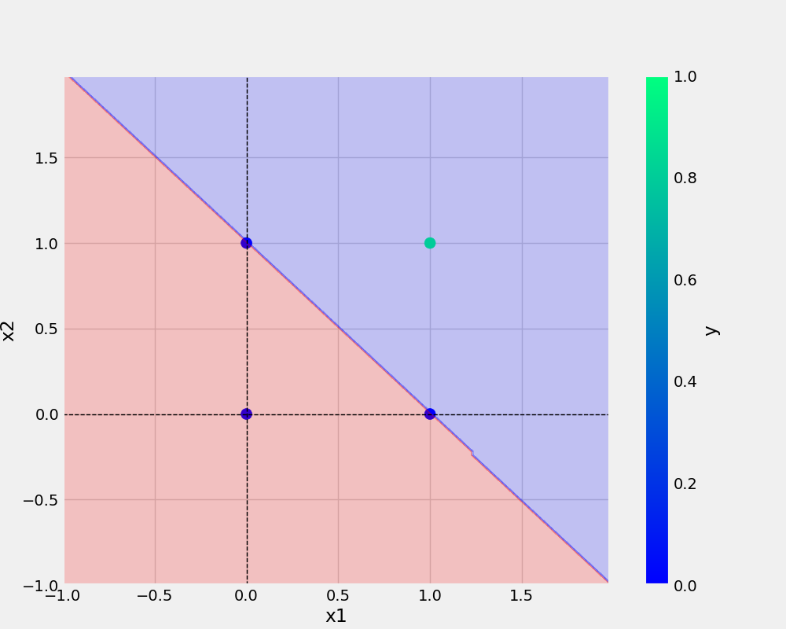
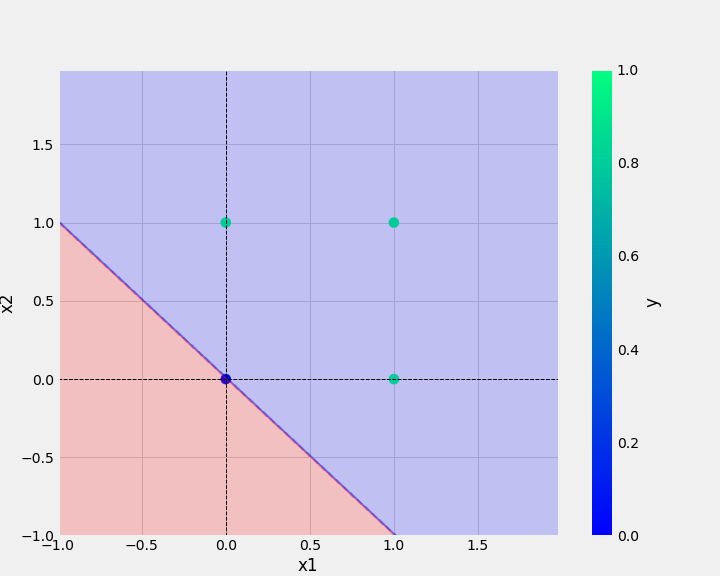

# perceptron_package
Perceptron Implementation using OR,AND,XOR and NAND gates.

# Info about perceptron(Single Layer Neural Network)
<a href="https://analyticsindiamag.com/perceptron-is-the-only-neural-network-without-any-hidden-layer/">Visit analyticsindiamag.com!</a>
# Dataset
### AND
x1 | x2 | y         
-|-|-
0|0|0
0|1|0
1|0|0
1|1|1
### 0R
x1 | x2 | y
-|-|-
0|0|0
0|1|1
1|0|1
1|1|1
    
# Python code for perceptron class
```python
class Perceptron:
  def __init__(self,eta,epochs):
    np.random.seed(42)
    self.weights = np.random.randn(3) * 10**-4
    logging.info(f"intial weights brfore training: {self.weights}")
    self.eta = eta
    self.epochs = epochs    #self declares variable as global for all the methods

  def activationFunction(self,inputs,weights): 
    z = np.dot(inputs,weights)
    return np.where(z>0, 1,0)
  
  def fit(self, X, y):
    self.X = X 
    self.y = y

    X_with_bias = np.c_[self.X, -np.ones((len(self.X), 1))] #concatenation of X and bias 
    logging.info(f"X with bias: {X_with_bias}")

    for epoch in tqdm(range(self.epochs),total=self.epochs, desc="training the model"):
      logging.info("--"*10)
      logging.info(f"for epoch: {epoch}")
      logging.info("--"*10)

      y_hat = self.activationFunction(X_with_bias, self.weights) #forward propogation
      logging.info(f"prdicted value after forward pass: \n{y_hat}")
      self.error = self.y - y_hat
      logging.info(f"error : \n{self.error}")
      self.weights = self.weights + self.eta * np.dot(X_with_bias.T, self.error) #backward propogation
      logging.info(f"updated weights after epoch : \n{epoch}/{self.epochs} : \n{self.weights}")
      logging.info("######"*10)

  def predict(self, X):
    X_with_bias = np.c_[X, -np.ones((len(X), 1))]
    return self.activationFunction(X_with_bias, self.weights)

  def total_loss(self):
    total_loss = np.sum(self.error)
    logging.info(f"total loss : {total_loss}")
    return total_loss
```
## PLOTS:-
* AND plot:


* OR plot: 

    

# Commands used-

```bash
git add . && git commit -m "docstring updated" && git push origin main
```

```bash
cp Sample\ Notebooks/demo.ipynb .
```

